# Enterprise Hybrid Identity Architecture: Active Directory to Okta Integration

## Project Overview
This repository provides an end-to-end implementation guide for integrating an on-premises Active Directory (AD) infrastructure with a cloud identity platform (Okta IdP). Utilizing the technical configuration baseline outlined in `AD_to_Okta_Setup_Guide.docx`, this architecture establishes Active Directory as the absolute source of truth for corporate identities[cite: 1]. 

This project simulates enterprise identity lifecycle states, precise LDAP attribute syncing, modern OAuth-based runtime authentication agent enrollment, and secure group provisioning rules across a hybrid enterprise topology.

### Solution Architecture Features
* **Source of Truth Delegation**: Enforces directory authorization management directly from an on-premises Domain Controller.
* **Least-Privilege Directory Scoping**: Implements targeted Organizational Unit (OU) filtering to minimize attack surfaces and limit directory syncing noise.
* **Secure OAuth Runtime Handshake**: Uses an interactive, tokenless device code verification loop to configure local middleware agents securely.
* **Bi-Directional Schema Visibility**: Demonstrates exact LDAP field mapping matching downstream cloud target metadata.

---

## Technical Prerequisites & Topology

### On-Premises Environment
* **Directory Services**: Windows Server 2022 Datacenter running functional Active Directory Domain Services (AD DS).
* **Internal Domain Namespace**: `Musah.com`
* **Network Context**: Internal LDAP port communication over standard boundaries (`389`).

### Cloud Identity Environment
* **Identity Platform**: Okta Developer Tenant Ecosystem (`org1-propp-2098f` instance control plane).
* **Super Administrator Core**: `user.admin@oktacertified.com`

### Integration Wrapper
* **Integration Middleware**: Okta Active Directory Agent executable distribution (Version `3.22.0`).

---

## Implementation & Deployment Steps

### Phase 1: Local Directory Scoping & Middleware Acquisition
1. Build out your core corporate organizational framework (`corp/finance`, `corp/hr`) within the Windows Domain Controller.
2. Generate an isolated directory service account (`okta-agent`) populated with standard read privileges over target containers.
3. Log into the cloud dashboard, browse to **Directory** > **Directory Integrations**, and locate the agent repository download point to fetch `OktaADAgentSetup-3.22.0-925-5b8361b.msi`.

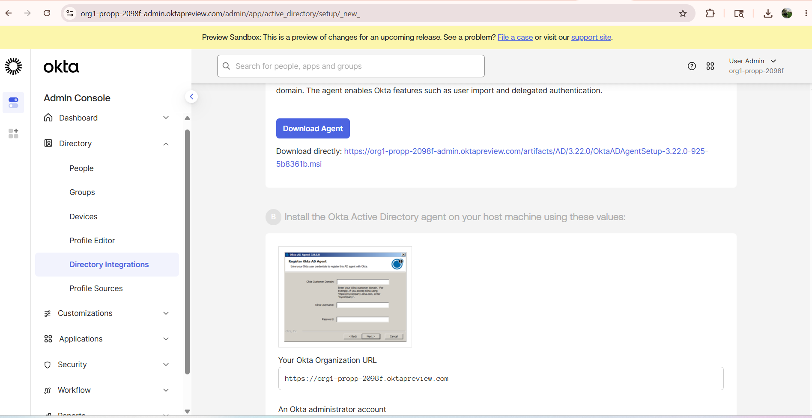

---

### Phase 2: Agent Deployment & Modern Device Authorization Flow
1. Execute the installer payload with elevated system rights on the domain instance host.
2. Bind the local engine to the active system domain root: `Musah.com`.

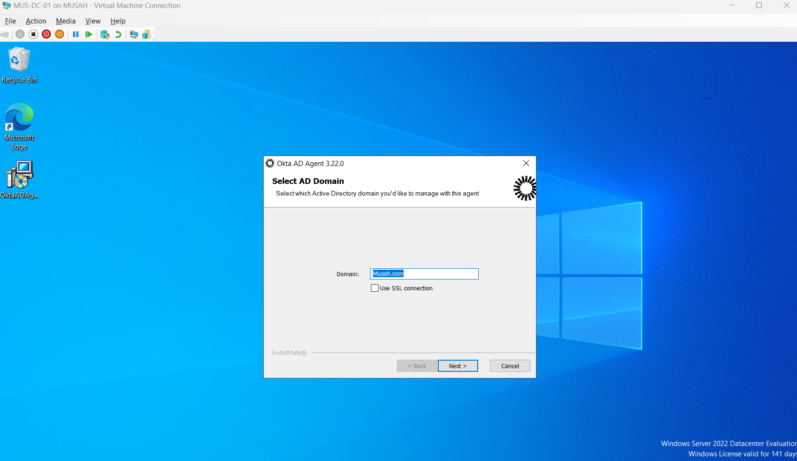

3. Authorize the secure control plane handshake utilizing the modern OAuth 2.0 Device Code workflow. Approve the access request payload when prompted by the identity client gateway.

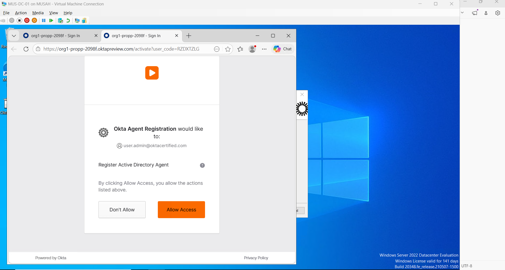

4. Once the verification portal signs off on the token request, the deployment process validates the secure tunnel setup.

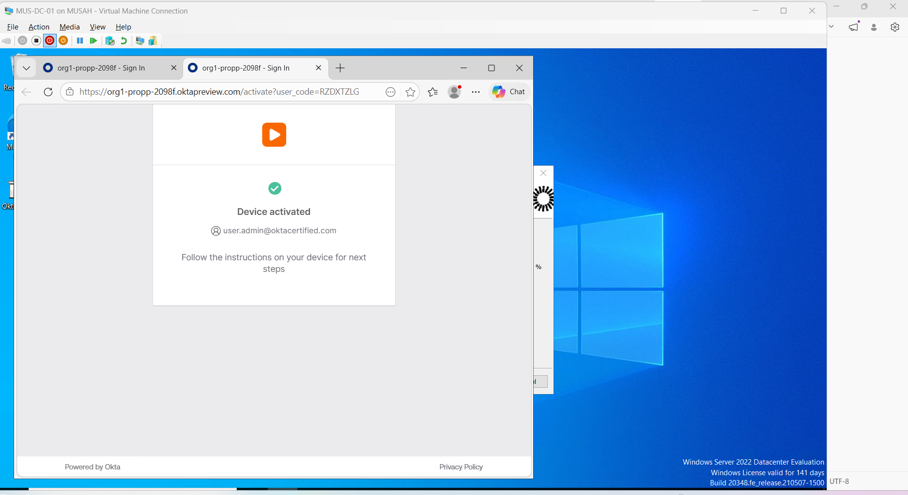
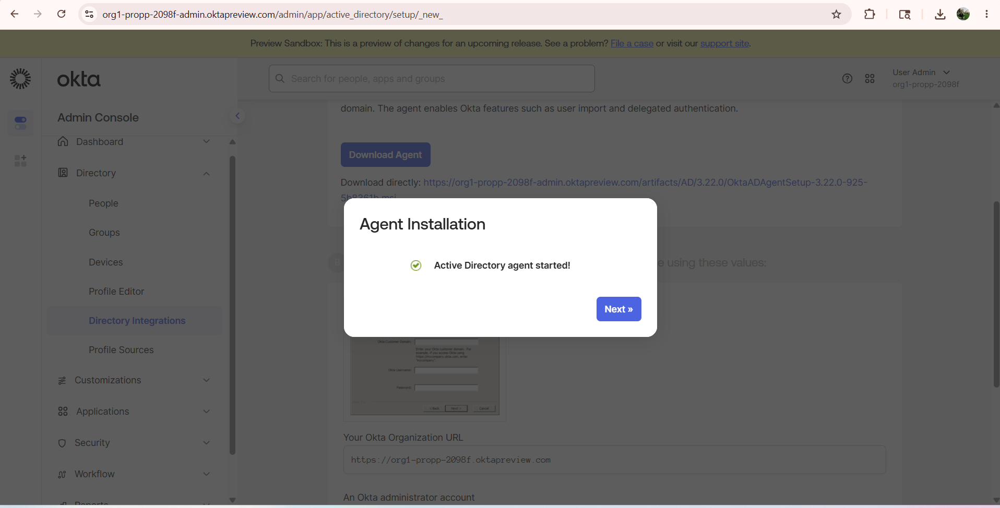

---

### Phase 3: Targeted Organizational Unit (OU) Sync Filters
To protect data privacy and maintain optimal performance, the integration isolates ingestion processing to designated user and group nodes rather than traversing the global directory tree.

1. **User Schema Scoping**: Isolate data tracking directly to the corporate container hierarchies (`corp/finance`, `corp/hr`).

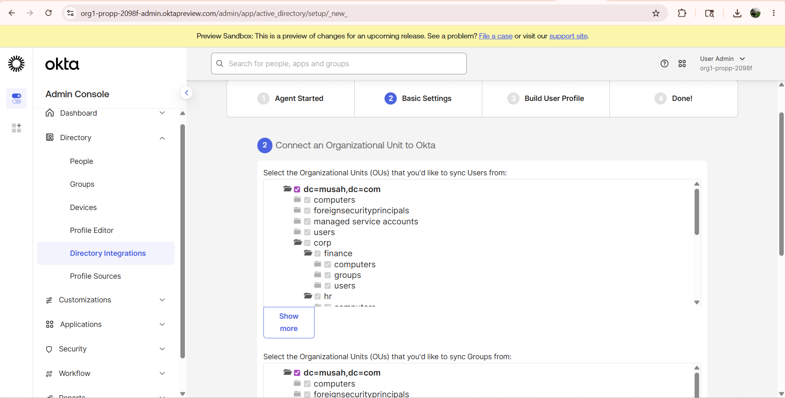

2. **Group Schema Scoping**: Constrain object discovery paths symmetrically to filter out infrastructure security boundaries.

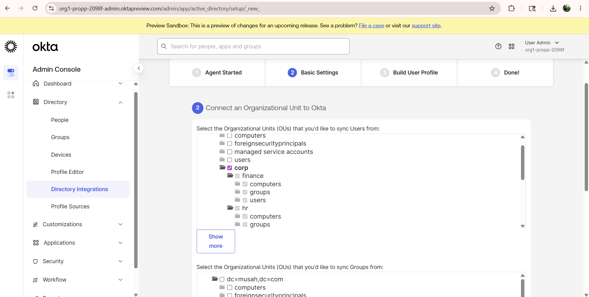

3. **Group Synchronization Mapping**: Define directory group sync rules to discover and translate on-premises object security boundaries cleanly into cloud application roles.

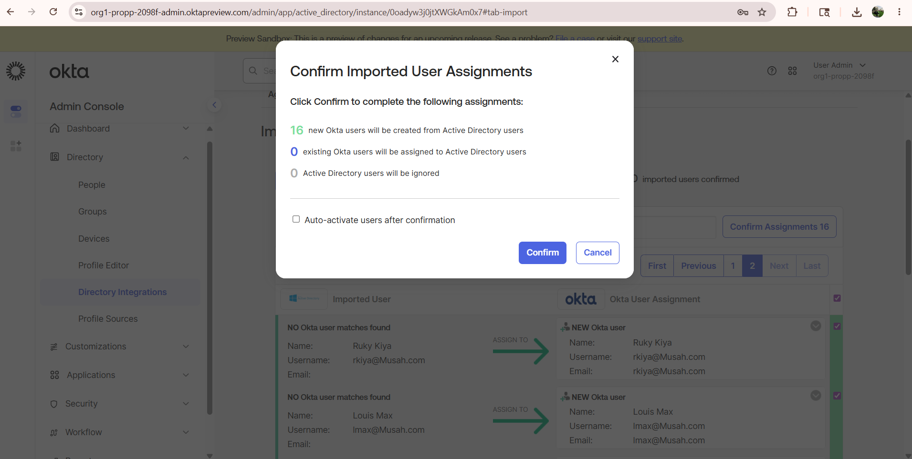

---

### Phase 4: Progressive Identity Ingestion Pipeline
1. Initiate an active data poll using the on-demand **Import Now** functional channel within the management layout.

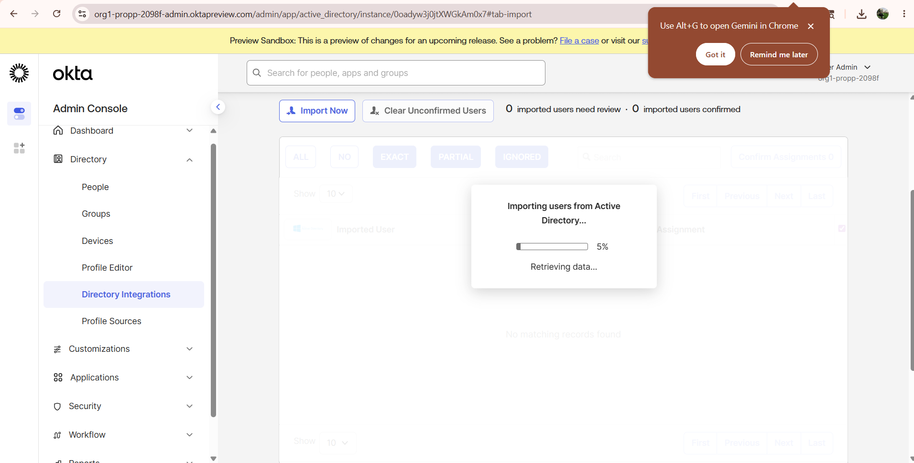

2. Evaluated objects are placed in an unconfirmed queue. Staging workflows flag unmatched objects as safety checkpoints to prevent administrative identity duplications.

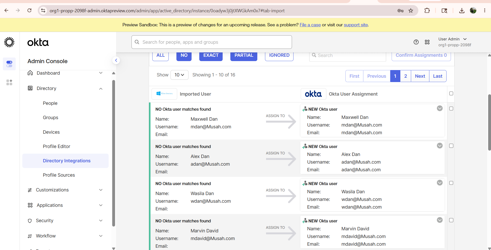

3. Execute the assignment confirmation process. Approve the migration block processing batch metrics (e.g., *16 new Okta users created*) to build the active accounts.

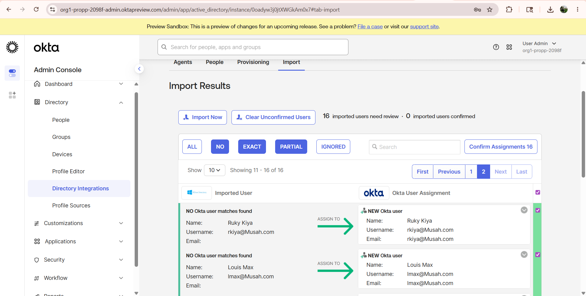

---

## Operational Verification & Data Integrity Auditing

### 1. Unified Directory Views
Following structural synchronization, both users and functional groups show up as fully active objects inside the cloud tenancy, retaining clear markers showing they are sourced from the on-premises AD ecosystem.

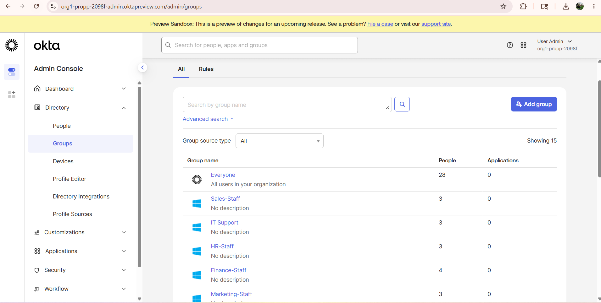
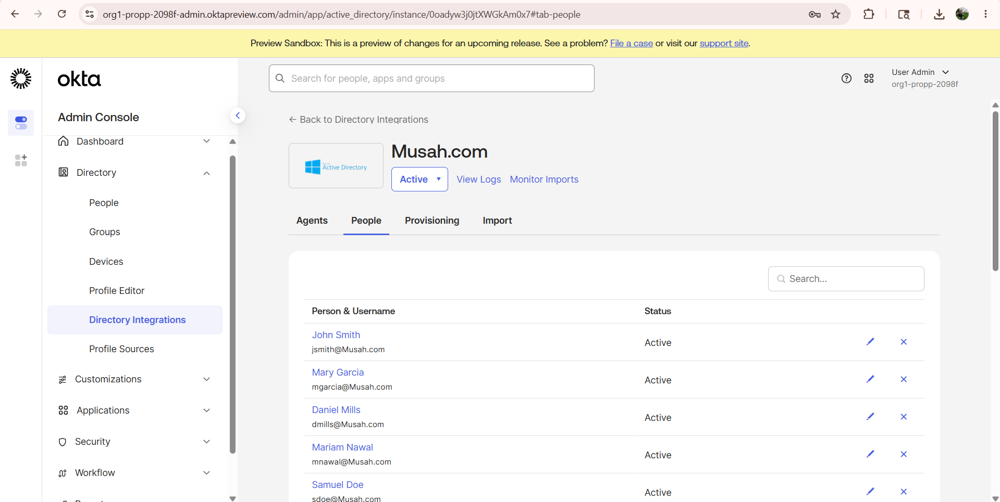

### 2. Precise Attribute Schema Mapping
To verify exact database mapping, individual profile strings can be traced directly from source to target. For example, check an employee's address attributes (such as the account file for `Ruky Kiya`) across both systems:

* **Active Directory Source**: `110 E Street, Queens, NY`
* **Okta Directory Destination**: Fields map exactly to corresponding cloud profile strings, confirming successful attribute profile synchronization.

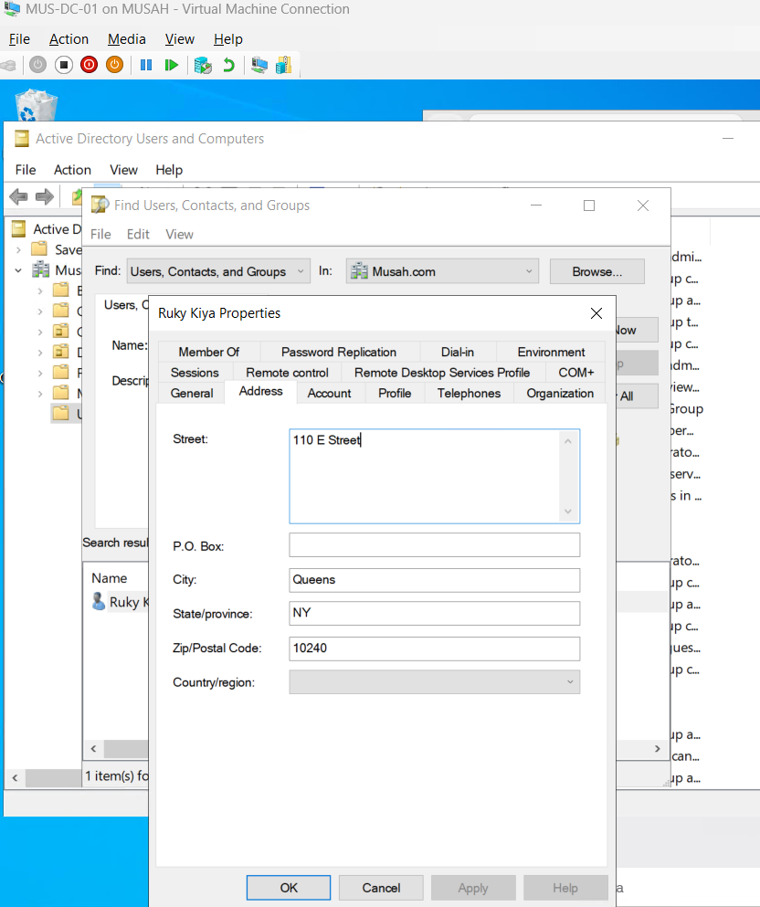
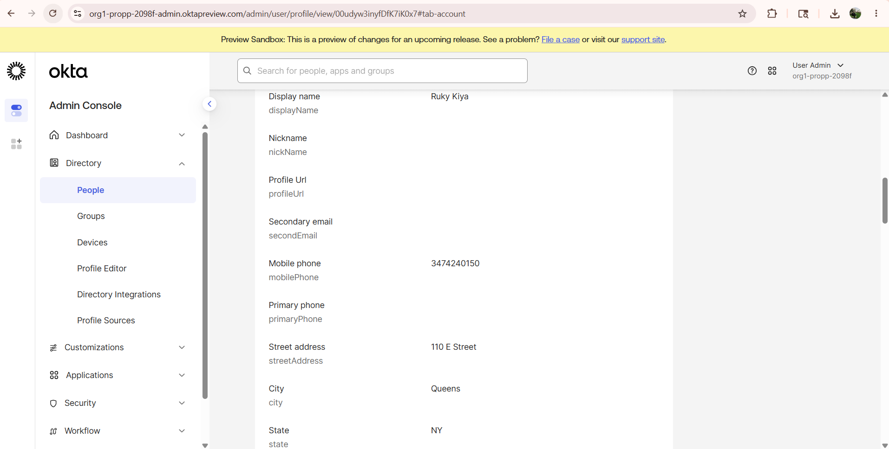

### 3. Continuous Differential Imports
Subsequent updates use differential scans to handle modifications efficiently. This ensures single-user schema updates or password modifications update in seconds without loading the entire network pipeline.

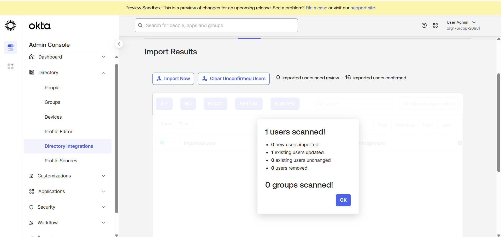

---

## End-User Access & Testing

### Application Provisioning Logic
Downstream software provisioning rules are configured using automated role assignment maps. This links security groups straight to authorized application dashboards based on their synchronized group memberships.

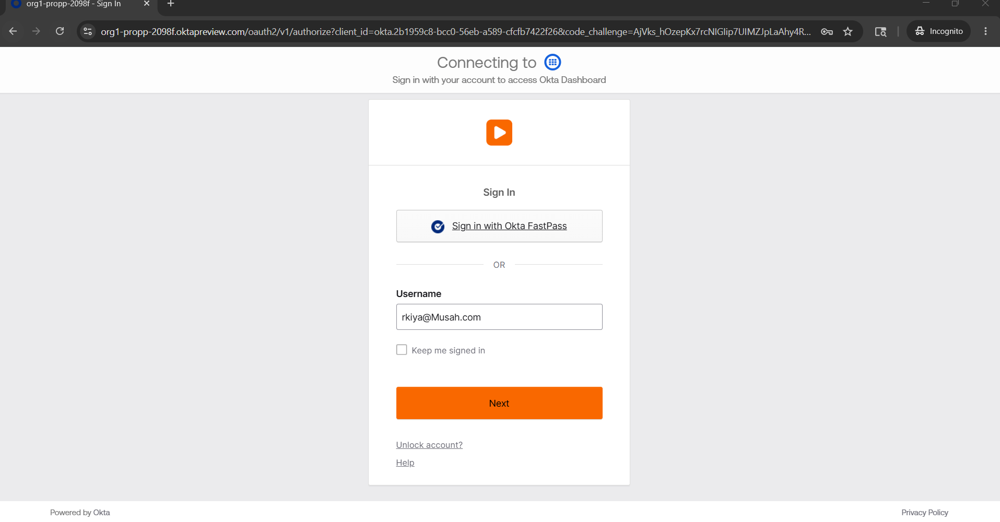

### Authentication Journey
* **User Authentication**: A user navigates to the cloud application page and inputs their email handle (e.g., `rkiya@Musah.com`).
* **Verification Loop**: Okta routes the verification check through the local agent tunnel to query the Domain Controller, validating the login securely without exposing the password to external networks.
* **Dashboard Access**: Upon authorization, the user lands safely on their single sign-on (SSO) portal dashboard.

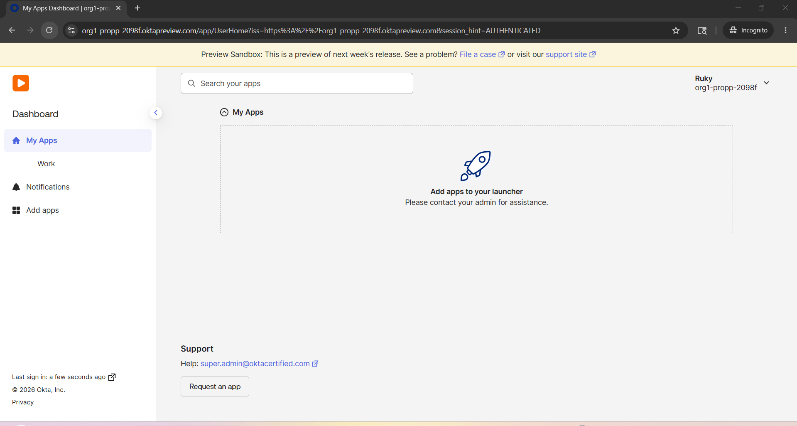
